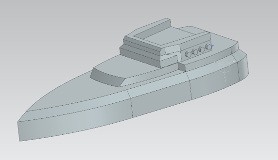
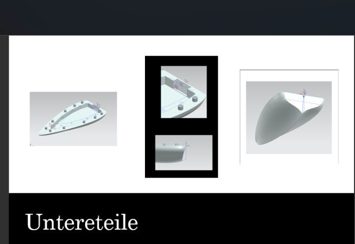
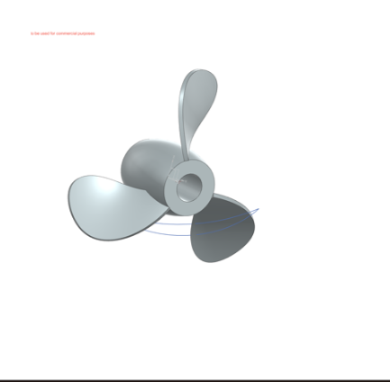
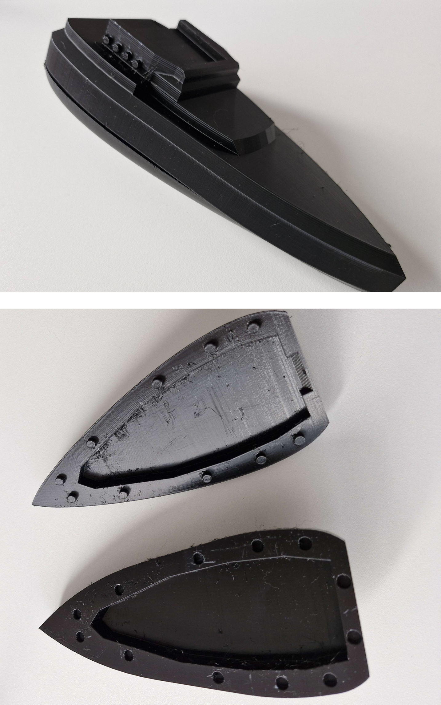

# Mechatronisches Konstruktionsprojekt – Modellschiff

Dieses Projekt entstand im Rahmen eines Hochschulmoduls im Bereich
Mechatronik und Konstruktion.

---

## Projektübersicht

Ziel des Projekts war die Entwicklung eines funktionsfähigen Modellschiffs
unter Anwendung eines systematischen ingenieurwissenschaftlichen
Konstruktionsprozesses.

---

## Konstruktionsprozess

- Erstellung einer Anforderungsliste  
- Konzeptentwicklung (morphologischer Kasten)  
- Mechanische Konstruktion mittels CAD  
- Prototypenfertigung durch 3D-Druck  
- Integration von Motor und Batteriesystem  
- Durchführung von Funktions- und Wassertests  

---

## CAD-Entwurf

---

## Konstruktion – Einzelkomponenten

### Oberteile

### Unterteile

### Propeller

---

## Realer Prototyp

---

## Funktionstest (Video)

[Erfolgreicher Wassertest des Prototyps](docs/assembly/Testing_Prototyp.mp4)

---

## Testergebnisse

Der Prototyp konnte erfolgreich schwimmen und funktionale Tests im Wasser
durchführen. Dabei wurde die grundlegende Stabilität sowie die
Antriebsfähigkeit nachgewiesen.

---

## Kontext

Hochschulprojekt im Bereich Mechatronik und Konstruktion.

##Autor 
Ahmad
